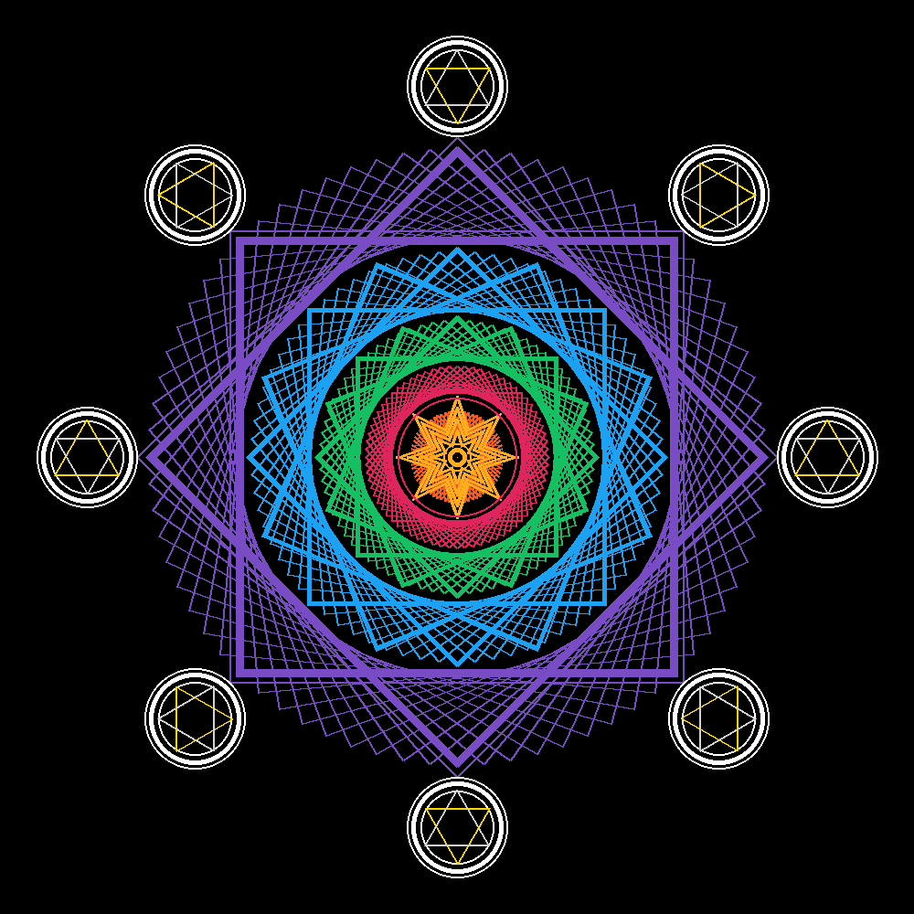

# Digital Mandala

* Designed my own digital mandala using an object-oriented Python program.
* Used the Pillow library (an active fork of the Python Imaging Library) to read the pixel values from an existng image file, modify them to encrypt a secret message, and save the modified values to a new image file.

## Description
* A mandala is composed of several repeating elements placed and rotated about a central point.
* Displays the image upon completion of the drawing, and save the image to a png file.

